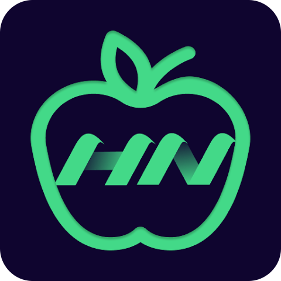
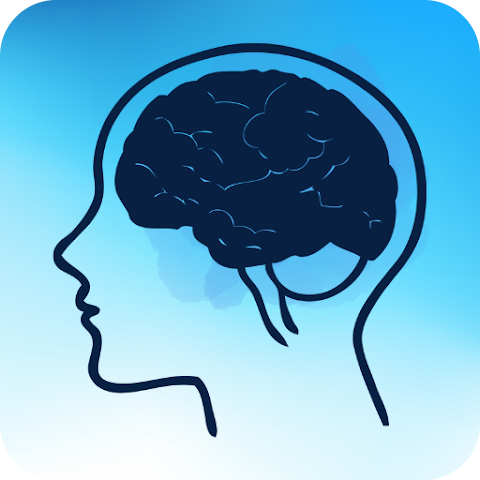
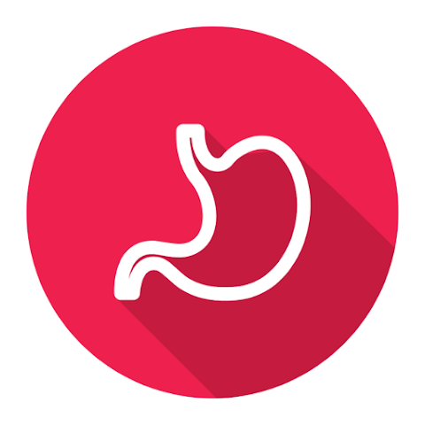

  

    Explore a world of innovation and creativity as we present our finest selection of cutting-edge mobile applications. Each app is meticulously crafted to deliver a seamless and engaging user experience, tailored to meet diverse needs and preferences.
  

<h1>Portfolio</h1>
  

    
     
    <a href="https://play.google.com/store/apps/details?id=com.knocklock.applock"><strong>Knock lock screen - Applock</strong> </a>
  Are you worried about exposing your PIN while you unlock your phone? 
Here comes <strong>Knock Lock - Applock</strong> for the rescue. The innovative Lock Screen that will leave intruders baffled!
     
    
     
     
    
     
    <a href="https://play.google.com/store/apps/details?id=knocklock.health.nutrition.foodguide.nutritionsforall.healthyfood"><strong>Health and Nutrition Guide</strong> </a>
  Nutrition science teaches us that food, not just individual nutrients, plays a vital role in our health. Whether you're looking to lose weight, get fit, or gain weight, our Health and Nutrition: Nutrition Food Guide app can help you achieve your goals and live a healthy, sustainable, and happy lifestyle. Whether you follow a vegetarian or non-vegetarian diet, it's important to consume a variety of nutrient-rich foods like whole grains, fruits, vegetables, legumes, nuts, seeds, and lean proteins like chicken, fish, mutton, and prawns.
     
    
     
     
    
     
    <a href="https://play.google.com/store/apps/details?id=mental.disorders.treatments"><strong>Mental disorders & Treatments</strong> </a>
 Are you struggling with mental health issues? Look no further than All Mental Disorders and Treatment, the all-in-one app for mental health management. With our comprehensive dictionary of mental disorders from A to Z, you can easily identify symptoms and find prevention measures and natural remedies.
     
    
     
     
    
     
    <a href="https://play.google.com/store/apps/details?id=stomach.diseases.treatment"><strong>All stomach Diseases & Treatment</strong> </a>
  All Stomach Diseases and Treatment app is a comprehensive resource for information on gastrointestinal diseases, digestive system diseases, and stomach health tips. It includes detailed information, high-quality pictures, and diagrams for various diseases of the digestive system. However, it is important to note that this app does not provide clinical practice guidelines and one should always seek medical help from a qualified physician when feeling unwell.
     
    
  

